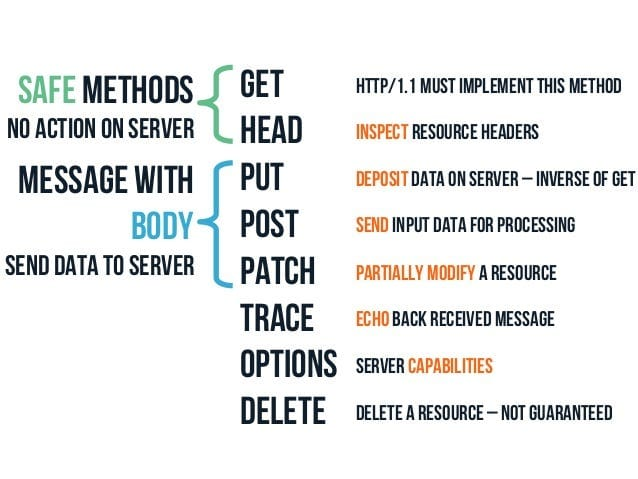

# Esami ed esercizi di reti di calcolatori

|                                                   |     Client,   Server, Proxy    |     Metodi       |
|---------------------------------------------------|--------------------------------|------------------|
|     [Authentication   and Authorization](auth)    |     Client,   Server, Proxy    |     Get          |
|     [Accept](accept)                              |     Client,   Server           |     Get          |
|     [BlackList](bl)                               |     Server,   Proxy            |     Get          |
|     [Cache](cache)                                |     Client                     |     Get          |
|     [Content   Length](cl)                        |     Client,   Server           |     Get          |
|     [Chunked](ck)                                 |     Client,   Server           |     Get          |
|     [Cookies](cookies)                            |     Client,   Server           |     Get          |
|     [Delay](delay)                                |     Server                     |     Get          |
|     [Form-urlencoded](form-urlencoded)            |     Client,   Server           |     Get, Post    |
|     [Head](head)                                  |     Client,   Server           |     Head         |
|     [Keep Alive](ka)                              |     Client,   Server, Proxy    |     Get          |
|     [Language](lang)                              |     Client,   Server, Proxy    |     Get          |
|     [Multipart](multipart)                        |     Client,   Server           |     Post         |
|     [Range](range)                                |     Client,   Server, Proxy    |     Get          |
|     [Reflect](reflect)                            |     Server                     |     Get          |
|     [SSL/TLS](ssl-tls)                            |     Client                     |     Get          |
|     [Trace](trace)                                |     Client                     |     Trace        |

