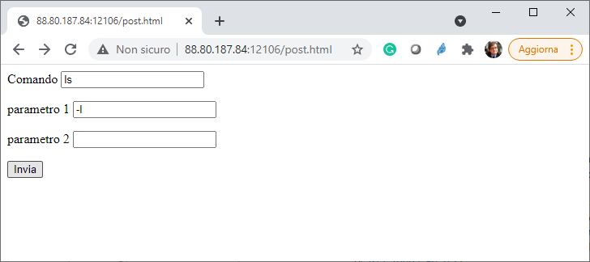

Esame di Reti di Calcolatori - 24 Giugno 2021

Si modifichi il programma web server esame.c in modo tale che supporti una tipologia di web application gateway (cgi) differente da quella finora supportata. 

Il client dovrà accedere tramite il programma web server alla risorsa http://88.80.187.84:<port>/post.html contenente il seguente sorgente html, già disponibile nella home di ciascuno.

```
<html>
<form action="/cgi-bin/command" method="post" enctype="x-www-form-urlencoded">
  <p>Comando <input type="text" id="mycom" name="commando" >
  <p>parametro 1 <input type="text" id="mypar1" name="param1" >
  <p>parametro 2 <input type="text" id="mypar2" name="param2" >
  <p> <input type="submit">
</form>
</html>
```
  
che corrisponde alla pagina Web visualizzata in figura.
  

  
  
La pagina consentirà all’utente, per tramite dell’User Agent (browser), di inserire il nome di un comando di shell UNIX da eseguire (per esempio ls) e uno o due parametri (per esempio -l).  
Alla pressione del bottone “Invia”, il browser invierà al Web server una  HTTP-request della risorsa /cgi-bin/command con il metodo POST contenente nel suo Entity Body il nome del comando e i due parametri secondo il medesimo formato (detto urlencoded) utilizzato nelle query string degli URL (v. RFC 1866 Cap. 8.2).
Il Web Server ricevendo la richiesta alla risorsa /cgi-bin/command dovrà eseguire il comando specificato con i parametri e riportare l’output di quel comando come Entity Body della HTTP-response.

--

Note aggiuntive: La parte di Message Body è trattata nella RFC 2616 Cap. 4, prestare attenzione ad eventuali codifiche ed escape di caratteri speciali e prestare attenzione alla RFC 2616 Cap. 4.4 relativamente al message length (non è necessario implementare il Transfer-Encoding per il Message Body).
