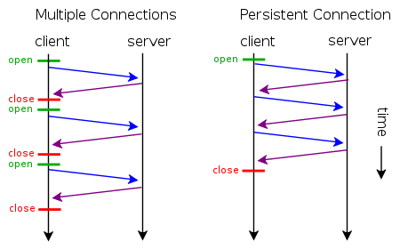

# Come funziona il Keep Alive

Il Keep Alive fa un modo che in una unica connessione il socket rimane in vita e permette di inviare più pagine, sullo stesso socket senza dover rinegoziare una connessione, in Keep alive ci sono meno aperture di socket e una unica connessione che viene usata per scaricare più elementi senza dover riconnetersi



Affinché sia possibile avere una connessione Keep Alive o Persistente  è necessario che il server utilizzi un sistema per determinare la fine di una richiesta e l'inizio della successiva diversa dalla chiusura della connessione. Le principali strategie sono
* `Content-Length`: nel caso di file generati dinamicamente richiede un aver generato tutta la pagina prima di poterla inviare, richiede una dimensione del buffer molto elevata
* `Transfer-Encoding: chunked`: è una variante del `Content-Length` che invia tanti blocchi detti chunked fino a fine pagina, richiede una dimensione del buffer ridotta.
Un esempio di chunked è:
```
4\r\n        (bytes to send)
Wiki\r\n     (data)
6\r\n        (bytes to send)
pedia \r\n   (data)
E\r\n        (bytes to send)
in \r\n
\r\n
chunks.\r\n  (data)
0\r\n        (final byte - 0)
\r\n         (end message)
```
Che decodificati porta al messaggio:
```
Wikipedia in

chunks.
```

La somma dei vari chunk-size è la `Content-Length` della pagina. Nel caso in cui la fine di un file viene determinata dalla chiusura del socket, tipico di HTTP/1.0 e 0.9 non è possibile in nessun modo fare richieste multiple, questo vare anche nel caso di inoltro di richieste, come nei Proxy, in quanto la connessione viene brutalmente chiusa.

P.S. se hai dubbi su questa affermazione poniti questa domanda: *Come è possibile determinare quando finisce una richiesta e quando inizia quella successiva senza un delimitatore?* la risposta più logica è quella giusta.

## Server Keep Alive

Nelle implementazioni di server e proxy keep alive è **importante** farlo **multithread** in quanto la connessione è persistente e se non fosse **multithread** fino a chiusura della connessione nuove richieste sarebbero in attesa.

P.S. se hai dubbi sull'affermazione precedente prova ad implementarlo senza thread e fai una richiesta da due browser diversi e poi vedi se funziona.

L'implementazione corretta di un Server KA chiude il thread appena non è più possibile leggere/scrivere sul socket. Se pensi che la suddetta implementazione non funziona o che è errata, pensaci due volte e ricordati che è il client che deve fare richieste Keep Alive al Server, e se il client non fa richieste KA il server non le può Unire.


## Proxy Keep Alive

Il proxy keep alive con connessione Client-Proxy KA ha semplicemente un ciclo do-while che termina quando il socket è stato chiuso e non è più possibile leggere/scrivere sul socket. 

Se pensi che la suddetta implementazione non funziona o che è errata, pensaci due volte e ricordati che è il client che deve fare richieste Keep Alive al Proxy, e se il client non fa richieste KA il proxy non le può Unire.

## HTTP/1.0, HTTP/1.1, HTTP/2.0 e HTTPS

Il keep alive non è standard in HTTP/1.0 e non è detto che un server in HTTP/1.0 accetti una connessione Keep-Alive, soprattutto se non può determinare il `Content-Lenght` a priori. In ogni caso è necessario specificare l'header `Connection: Keep-Alive`.

In HTTP/1.1 la connessione Keep-Alive è di default, e non è necessario specificare nessun Header. Però è necessario inviare i dati con una `Content-Length` valida o con `Transfer-Encoding: chunked`.

Normalmene in HTTPS è necessario specificare alla connessione di condividere l'host validation e alcuni dettagli della connession crittografata. HTTP/2.0 consente connessioni keep alive in maneira senza ordinamento, nel senso che si possono inviare più richieste senza attendere la risposta (a differenza di HTTP/1.1 e 1.0 dove il comportamento non è definito) e  le risposte possono arrivare in maniera non ordinata. E c'è anche il push predittivo nel senso che possono essere inviate risorse non richieste.


## Come si implementa in C?

Le API socket C non permettono di ascoltare se c'è un eventuale FIN a livello. Il metodo più banale è verificare se la write o la read non vanno a buon fine (ritornano `-1`) e quindi si presume che il client si sia disconnesso. Questo metodo non sembra dare buoni risultati anche se concettualmente giusto

L'alternativa è quindi controllare questa condizione: `recv(s2, NULL, 1, MSG_PEEK | MSG_DONTWAIT) != 0` e che non ci sia l'header `Connection: close`.

