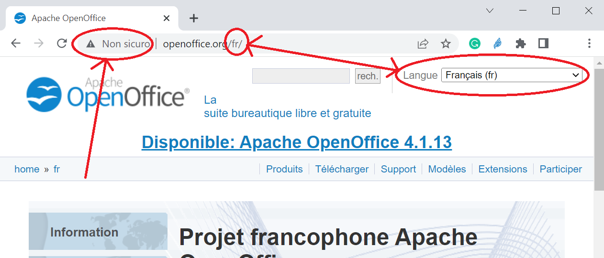

Esame di Reti di Calcolatori - 1 Luglio 2022

Il sito web openoffice.org consente, oltre all’accesso sicuro (HTTPS su port 443), anche
l’accesso non sicuro (HTTP su port 80) e prevede la selezione manuale della lingua dei contenuti,
tramite un selettore posto nella home page in alto a destra, che richiama l’URL specifico
corrispondente alla home page scritta nella lingua selezionata (es. francese nella figura qui sotto)

Dati questi presupposti, si richiede di modificare il programma `<matricola>.c` (che è il sorgente
del Web Proxy sviluppato a lezione), presente nella vostra `/home/<matricola>` in modo tale che

- Utilizzi il vostro port[^1] personalizzato, al quale il browser Microsoft Edge potrà collegarsi per la
modalità di accesso tramite proxy (opportunamente configurato agendo sul menù
`edge://settings/?search=proxy`, alla voce “Altre impostazioni Proxy del Computer”).

- Quando l’utente accederà alla home page di openoffice.org con il browser configurato per
la lingua preferita a seconda di come viene impostata tramite il menù
`edge://settings/languages`, il proxy provvederà a recapitare al client i contenuti della
home page corrispondente alla lingua preferita, senza che l’utente debba utilizzare
manualmente il selettore sulla pagina web. Le lingue che il proxy potrà selezionare saranno
solamente italiano, tedesco, francese, spagnolo, a seconda delle priorità espresse dal
browser, o inglese se il browser esprimerà preferenze per altre lingue ancora, o per l'inglese
stesso.

NB: Si faccia riferimento alla RFC 2616, Sezioni 14.4 e 14.12, per la gestione della lingua in HTTP.

Scrivere (come `/* commento */` all'inizio del file `<matricola>.c`) una breve relazione su
- Funzionalità puntuali da aggiungere, punti di intervento neĺ programma, eventuali scelte
implementative, descrizione dell’esecuzione e verifica correttezza.

--
[^1]: Per effettuare il test si utilizzi il port indicato nel file port.txt della vostra “home”